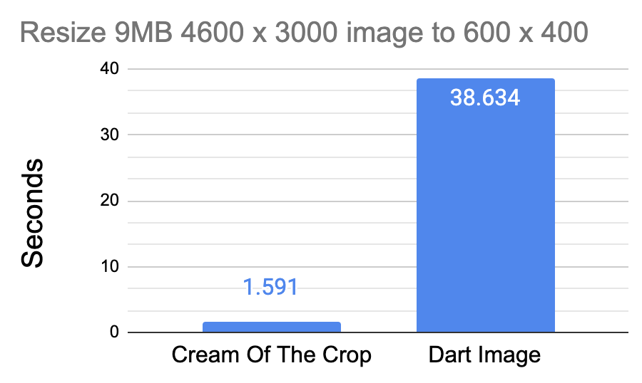
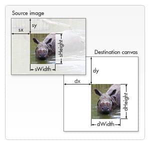

# Cream Of The Crop
Blazingly fast image crop and resize processing for Flutter Web.

**Features:**
- Crop
- Resize

### Why?
This package exists to offer a high performance option for image resize and crop transformations _on web_. 
Due to the nature of dart, an [image](https://pub.dev/packages/image) transformer writen in pure dart is slow on web. See the performance warning on that package for details.



### How?

In almost all modern web browsers, **cream_of_the_crop** can leverage the GPU Accelerated HTML &lt;canvas&gt; element to perform resize and crop operations.

### Demo
Launch the app in the example folder to see the performance difference between canvas and pure dart.

### No User Interface
This package has no user interface. It is designed to be used with [crop_image](https://pub.dev/packages/crop_image)
or any other cropping library that doesn't handle its own image transformation. **crop_image** provides a user interface
for cropping the image, and generates crop values that this package can consume to transform the image data.

### iOS / Android?
This package is for web only. Make use of the `kIsWeb` conditional to ensure you are only calling its functions on web.
Other platforms will throw an unimplemented error.

The [image](https://pub.dev/packages/image) package is more performant on iOS and Android devices, and can
provide a good user experience for those platforms. There is potential to add native Swift and Kotlin code to
handle these tasks even faster. Consider checking out [flutter_native_image](https://pub.dev/packages/flutter_native_image).

# Installation:
Add more readme for setup and use

# Crop Instructions:
The crop command takes several variables. Please reference the [mozilla developer docs](https://developer.mozilla.org/en-US/docs/Web/API/CanvasRenderingContext2D/drawImage)
for a description of that they mean.



Image source: [Mozilla mdn docs](https://developer.mozilla.org/en-US/docs/Web/API/CanvasRenderingContext2D/drawImage)

```dart
import 'package:cream_of_the_crop/cream_of_the_crop.dart';

final _creamOfTheCropPlugin = CreamOfTheCrop();

Uint8List? crop() async {
  return await _creamOfTheCropPlugin.cropImage(
    imageBytes,
    sx, sy,  // Crop position relative to the top left of the original image
    sw, sh,  // Width and height of the area to remain
    dx, dy,  // Relative position on the destination canvas (almost always 0,0 since creating a canvas larger than the desired image is not supported right now)
    dw, dh,  // Final width and height of the finished image
    quality, 
    imageExportType,
  );
}
```

To calculate these values, it may be useful to use the `dart:ui` package's `Image()` object to obtain the original image's width and height.
```dart
import 'dart:ui' as ui;

void getImage() async {
  // Image Picker
  final XFile? image = await imagePicker.pickImage(source: ImageSource.gallery);

  if (image != null) {
    // Read as bytes
    Uint8List bytes = await image.readAsBytes();

    // Decode as image
    ui.Image decoded = await decodeImageFromList(bytes);
    
    print("Image Width: ${decoded.width}, Height: ${decoded.height}");
  }
}
```

Given an original image of 6000 x 4000 dimensions, cropping to a 500 x 500 square.
```dart
// dart:ui decoded original image dimensions
int decodedWidth = 6000;
int decodedHeight = 4000;

// Desired final pixel size of the image
int exportWidth = 500;
int exportHeight = 500;

// Values provided by crop_image package cropping UI
double cropTop = 410;
double cropRight = 1732;
double cropBottom = 1252;
double cropLeft = 890;

// Calculated crop values needed to create the cropped image data
int sx = cropLeft;
int sy = cropTop;
int sw = decodedWidth - cropLeft - cropRight;
int sh = decodedHeight - cropTop - cropBottom;
int dx = 0;
int dy = 0;
int dw = exportWidth;
int dh = exportHeight;
```


# Room for Improvement
Very large images (over 15MB) can take 2-3 seconds to process. The image processing blocks the main UI thread so a progress indicator won't animate.
This could potentially be fixed by moving the processing code over to external javascript and setting up a web worker, however, the installation
process would be much more complex for the package user. 

A typical 10MP smart phone photo of ~5MB can be processed in under 1 second on an average computer, so in most cases the experience should be good enough as is.